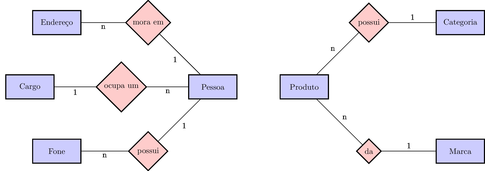
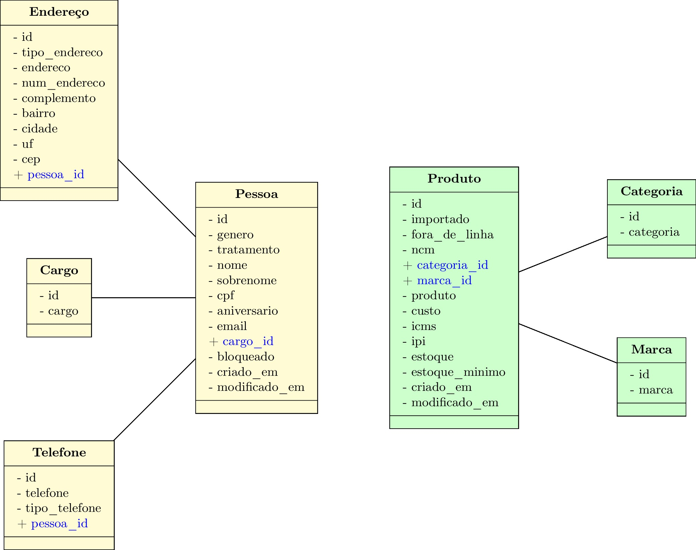
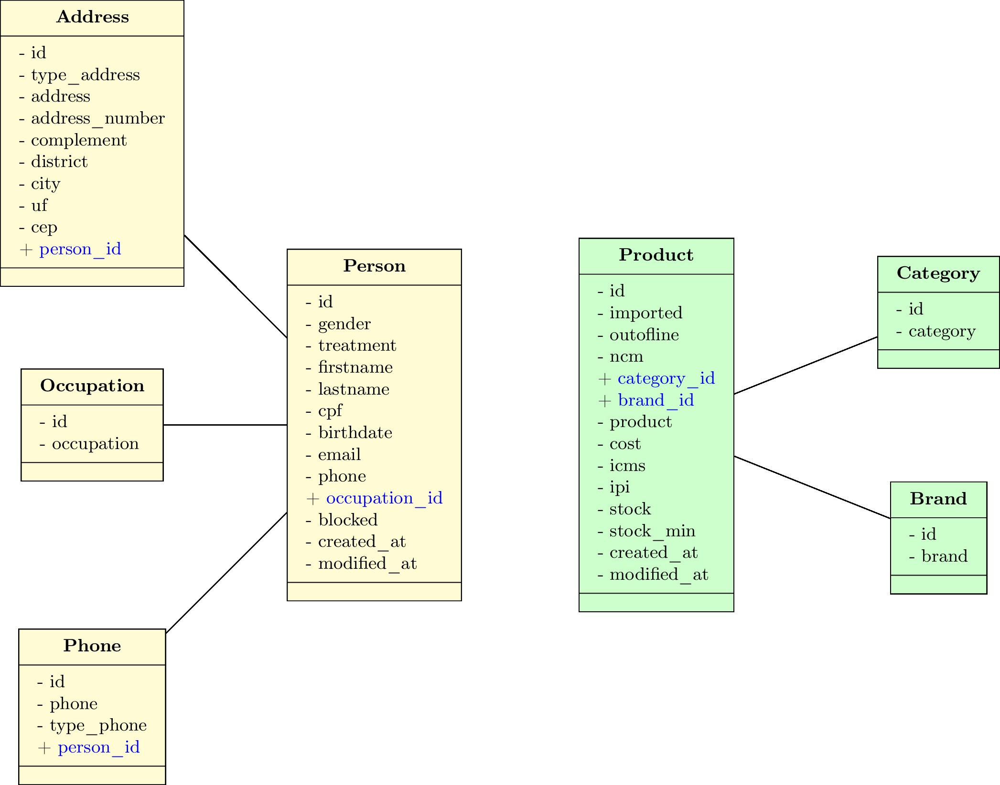
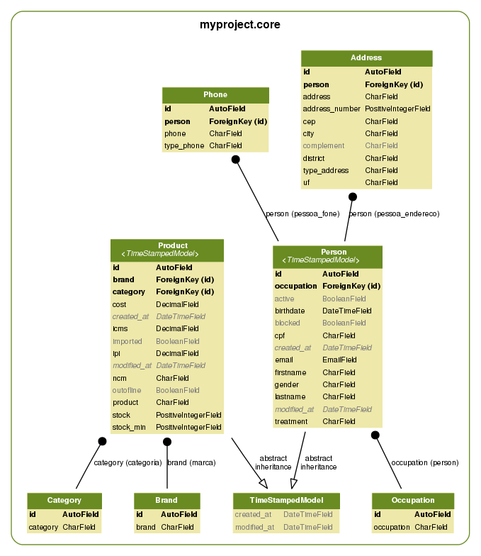

django-example
==============

# Modelo

**mer.tex** é a modelagem conceitual (coloquei apenas as entidades). Para fazer este documento eu usei o [LaTeX][9] junto com o pacote [tikz-er2][10].

Para compilar o documento use o comando (precisa instalar o *latexmk*)

	$ latexmk -pdf mer.tex && latexmk -c

Para converter o **pdf** em **jpg** use o [Imagemagick][11].

	$ convert -density 300 mer.pdf mer.jpg

**tabelas.tex** foi feito em [LaTeX][9] junto com o pacote [tikz-uml][12].

# Notas

Para gerar **core.png** use a biblioteca [django-extensions][1] junto com

	$ ./manage.py graph_models -a -g -o core.png

ou

	$ ./manage.py graph_models -e -g -l dot -o core.png core

Se der **erro**, instale *pyparsing* novamente desta forma:

	$ pip uninstall pyparsing
	$ pip install -Iv https://pypi.python.org/packages/source/p/pyparsing/pyparsing-1.5.7.tar.gz#md5=9be0fcdcc595199c646ab317c1d9a709
	$ pip install pydot
	$ pip freeze > requirements.txt

Leia [django-notes][8].

[0]: https://www.djangoproject.com/
[1]: http://django-extensions.readthedocs.org/en/latest/
[2]: https://docs.djangoproject.com/en/dev/ref/class-based-views/
[3]: https://docs.djangoproject.com/en/dev/ref/class-based-views/base/#templateview
[4]: https://docs.djangoproject.com/en/dev/ref/class-based-views/generic-display/#listview
[5]: https://docs.djangoproject.com/en/dev/ref/class-based-views/generic-editing/#formview
[8]: http://django-notes.blogspot.com.br/2012/07/vizualization.html
[9]: http://latexbr.blogspot.com.br/
[10]: https://bitbucket.org/pavel_calado/tikz-er2/wiki/Home
[11]: http://grandeportal.blogspot.com.br/2012/06/editando-imagens-no-imagemagick.html
[12]: http://perso.ensta-paristech.fr/~kielbasi/tikzuml/index.php?lang=en
[13]: http://rg-vendas.herokuapp.com/